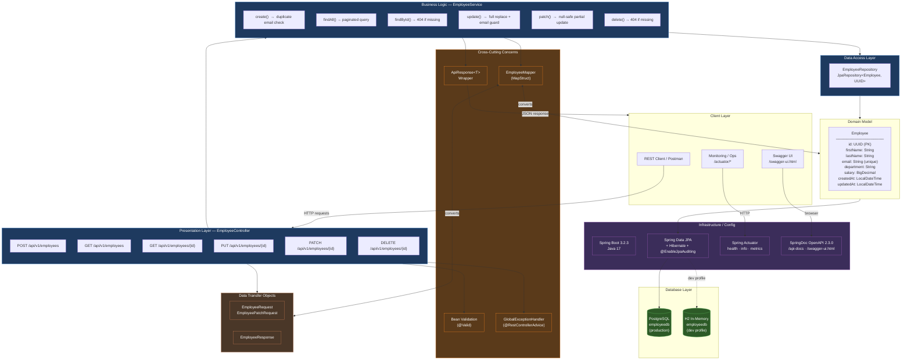
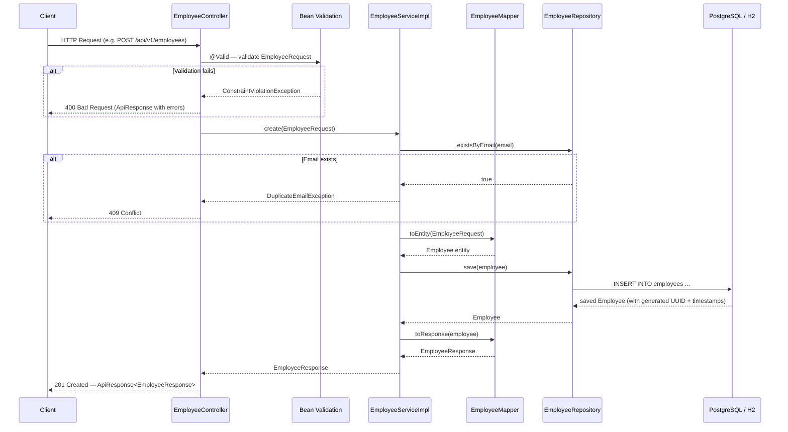

# Employee Service — Architecture Diagram

## System Architecture

---

## Request / Response Flow

---

## Component Overview

| Layer | Class | Responsibility |
|-------|-------|----------------|
| **Controller** | `EmployeeController` | HTTP routing, request validation, OpenAPI docs |
| **Service Interface** | `EmployeeService` | Contract for business operations |
| **Service Impl** | `EmployeeServiceImpl` | Business logic, transactions, email uniqueness |
| **Repository** | `EmployeeRepository` | Spring Data JPA — CRUD + custom queries |
| **Entity** | `Employee` | JPA entity, audit timestamps |
| **DTOs** | `EmployeeRequest/Response` | Input/output contracts |
| **Mapper** | `EmployeeMapper` | MapStruct — Entity ↔ DTO conversion |
| **Exception Handler** | `GlobalExceptionHandler` | Centralized error responses |
| **Config** | `application.yml` | Profiles (dev/prod), DB, actuator, logging |

---

## Technology Stack

| Concern | Technology |
|---------|-----------|
| Language | Java 17 |
| Framework | Spring Boot 3.2.3 |
| Web | Spring MVC (REST) |
| Persistence | Spring Data JPA + Hibernate |
| Database (prod) | PostgreSQL 5432 |
| Database (dev) | H2 In-Memory |
| Validation | Jakarta Bean Validation |
| Mapping | MapStruct 1.5.5 + Lombok |
| API Docs | SpringDoc OpenAPI 2.3.0 |
| Monitoring | Spring Actuator |
| Build | Maven |
| Testing | JUnit 5 + Mockito |
